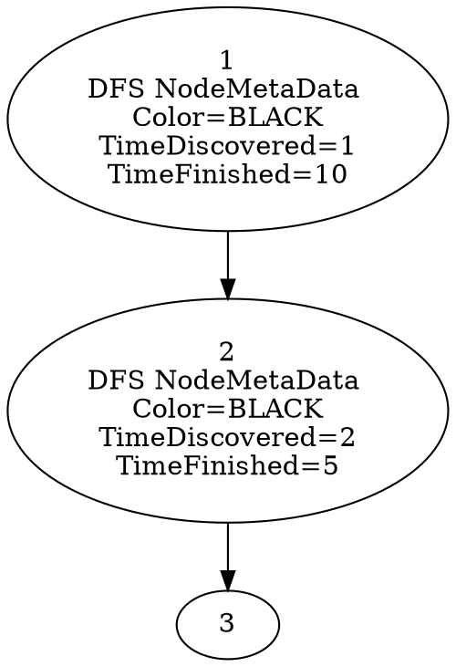

# Complete Tutorial: Creating Graphs, Running DFS, and Visualizing with Graphviz

## Table of Contents
1. [Prerequisites](#prerequisites)
2. [Step 1: Creating Nodes](#step-1-creating-nodes)
3. [Step 2: Creating Edges](#step-2-creating-edges)
4. [Step 3: Building an Undirected Graph](#step-3-building-an-undirected-graph)
5. [Step 4: Building a Directed Graph](#step-4-building-a-directed-graph)
6. [Step 5: Running the DFS Algorithm](#step-5-running-the-dfs-algorithm)
7. [Step 6: Setting Up Graphviz Visualization](#step-6-setting-up-graphviz-visualization)
8. [Step 7: Generating the DOT File](#step-7-generating-the-dot-file)
9. [Step 8: Creating Visual Output](#step-8-creating-visual-output)
10. [Understanding the Results](#understanding-the-results)
11. [Complete Example Code](#complete-example-code)
12. [Advanced Tutorial: Creating Custom Algorithm Classes]
13. [Troubleshooting]


## Prerequisites

Before starting, ensure you have:
- A C# development environment (Visual Studio, VS Code, or similar)
- Graphviz installed on your system:
  - **Windows**: Download from [graphviz.org](https://graphviz.org/download/) and add to PATH
  - **Mac**: `brew install graphviz`
  - **Linux**: `sudo apt-get install graphviz` (Ubuntu/Debian)

## Step 1: Creating Nodes

Nodes are the fundamental building blocks of any graph. Each node gets a unique identifier automatically.

```csharp
// Create individual nodes
Node node1 = new Node();  // Creates "Node_1"
Node node2 = new Node();  // Creates "Node_2"
Node node3 = new Node();  // Creates "Node_3"
Node node4 = new Node();  // Creates "Node_4"
Node node5 = new Node();  // Creates "Node_5"
```

**What happens behind the scenes:**
- Each node gets a unique serial number (1, 2, 3, etc.)
- The name is automatically generated as "Node_X" where X is the serial number
- An empty metadata dictionary is created for storing algorithm results later

## Step 2: Creating Edges

Edges connect nodes together. Each edge needs a source node and a target node.

```csharp
// Create edges connecting the nodes
Edge edge1 = new Edge(node1, node2);  // node1 → node2
Edge edge2 = new Edge(node2, node3);  // node2 → node3
Edge edge3 = new Edge(node1, node4);  // node1 → node4
Edge edge4 = new Edge(node1, node5);  // node1 → node5
Edge edge5 = new Edge(node4, node5);  // node4 → node5
Edge edge6 = new Edge(node3, node5);  // node3 → node5
```

**Important notes:**
- Edges are directional by nature (source → target)
- In undirected graphs, the direction is ignored
- Each edge gets a unique serial number and name automatically

## Step 3: Building an Undirected Graph

An undirected graph treats edges as bidirectional connections.

### Understanding UndirectedAdjacencyListStorage

`UndirectedAdjacencyListStorage` is the data structure that stores your graph efficiently:

```csharp
// This storage class maintains:
// - A list of all nodes in the graph
// - A list of all edges in the graph  
// - A dictionary mapping each node to its connected edges
Dictionary<INode, List<IEdge>> edgesByNode = new Dictionary<INode, List<IEdge>>();
```

**How it works:**
- Each node has a list of ALL edges it participates in (as source OR target)
- When you add an edge, it gets added to BOTH endpoints' edge lists
- This enables fast neighbor lookup: O(degree of node) instead of O(total edges)

**Example visualization:**
```
If you have: node1 ↔ node2 ↔ node3
             node1 ↔ node4

edgesByNode looks like:
node1: [edge(1,2), edge(1,4)]
node2: [edge(1,2), edge(2,3)]  
node3: [edge(2,3)]
node4: [edge(1,4)]
```

```csharp
// Create undirected graph with adjacency list storage
UnDirectedGraph graph = new UnDirectedGraph(
    new UndirectedAdjacencyListStorage(), 
    "MyUndirectedGraph"
);

// Add all nodes first
graph.AddNode(node1);
graph.AddNode(node2);
graph.AddNode(node3);
graph.AddNode(node4);
graph.AddNode(node5);

// Add edges (order doesn't matter for undirected graphs)
graph.AddEdge(edge1);  // node1 ↔ node2
graph.AddEdge(edge2);  // node2 ↔ node3
graph.AddEdge(edge3);  // node1 ↔ node4
graph.AddEdge(edge4);  // node1 ↔ node5
graph.AddEdge(edge5);  // node4 ↔ node5
// Note: edge6 not added to keep undirected example simpler
```

**Key points:**
- Always add nodes before adding edges
- The system validates that both endpoints of an edge exist in the graph
- In undirected graphs, if you can go from A to B, you can also go from B to A
- The storage automatically handles bidirectional relationships

## Step 4: Building a Directed Graph

A directed graph respects the direction of edges.

### Understanding DirectedAdjacencyListStorage

`DirectedAdjacencyListStorage` is more sophisticated than the undirected version:

```csharp
// This storage class maintains:
// - A list of all nodes and edges (like undirected)
// - Separate dictionaries for incoming and outgoing edges per node
Dictionary<INode, List<IEdge>> outgoingEdge = new Dictionary<INode, List<IEdge>>();
Dictionary<INode, List<IEdge>> incomingEdge = new Dictionary<INode, List<IEdge>>();
```

**How it works:**
- Each node tracks its outgoing edges (edges where it's the source)
- Each node tracks its incoming edges (edges where it's the target)  
- This enables efficient queries for predecessors and successors
- Direction matters: A→B doesn't mean B→A

**Example visualization:**
```
If you have: node1 → node2 → node3
             node1 → node4

outgoingEdge:
node1: [edge(1,2), edge(1,4)]
node2: [edge(2,3)]
node3: []
node4: []

incomingEdge:
node1: []
node2: [edge(1,2)]  
node3: [edge(2,3)]
node4: [edge(1,4)]
```

```csharp
// Create directed graph with directed adjacency list storage
DirectedGraph directedGraph = new DirectedGraph(
    new DirectedAdjacencyListStorage(), 
    "MyDirectedGraph"
);

// Add all nodes
directedGraph.AddNode(node1);
directedGraph.AddNode(node2);
directedGraph.AddNode(node3);
directedGraph.AddNode(node4);
directedGraph.AddNode(node5);

// Add all edges (direction matters!)
directedGraph.AddEdge(edge1);  // node1 → node2
directedGraph.AddEdge(edge2);  // node2 → node3
directedGraph.AddEdge(edge3);  // node1 → node4
directedGraph.AddEdge(edge4);  // node1 → node5
directedGraph.AddEdge(edge5);  // node4 → node5
directedGraph.AddEdge(edge6);  // node3 → node5
```

**Key differences from undirected:**
- Edge direction is preserved and enforced
- You can have edges A → B without B → A
- Different algorithms and analysis apply
- Storage overhead is higher (two dictionaries vs one)

## Step 5: Running the DFS Algorithm

DFS (Depth-First Search) explores as far as possible along each branch before backtracking.

### Understanding DFS.MetadataKey

`DFS.MetadataKey` is a crucial concept for how algorithm results are stored:

```csharp
public class DFS : BaseAlgorithm {
    // This is the key used to store DFS results in each node's metadata
    public static string MetadataKey => "DFS";
    
    // This is the data structure stored under that key
    public class DFS_NodeMetaData {
        public string Color;         // WHITE, GRAY, BLACK
        public int TimeDiscovered;   // When node was first visited
        public int TimeFinished;     // When node processing completed
    }
}
```

**How metadata storage works:**
- Every node has a `MetaData` dictionary: `Dictionary<object, object>`
- DFS stores its results using the key "DFS" 
- The value is a `DFS_NodeMetaData` object containing algorithm state

**Example of metadata after DFS runs:**
```csharp
// For node1, you could access DFS results like this:
var dfsData = (DFS.DFS_NodeMetaData)node1.MetaData["DFS"];
Console.WriteLine($"Color: {dfsData.Color}");              // "BLACK"
Console.WriteLine($"Discovered: {dfsData.TimeDiscovered}"); // e.g., 1
Console.WriteLine($"Finished: {dfsData.TimeFinished}");     // e.g., 10

// Or use the helper methods:
string color = DFS.Color(node1);           // "BLACK"
int discovered = DFS.TimeDiscovered(node1); // 1  
int finished = DFS.TimeFinished(node1);     // 10
```

```csharp
// Create and configure DFS algorithm
DFS dfs = new DFS();
dfs.SetGraph(directedGraph);  // or use 'graph' for undirected

// Execute the algorithm
dfs.Execute();
```

**What DFS does step by step:**
1. **Initialize**: All nodes start as WHITE (unvisited), times set to -1
2. **Visit**: For each unvisited node, start a DFS traversal:
   - Mark node as GRAY (currently visiting)
   - Record discovery time (incrementing counter)
   - Recursively visit all unvisited neighbors
   - Mark node as BLACK (finished)
   - Record finish time (incrementing counter)

**DFS Results Stored in Node Metadata:**
- `Color`: 
  - WHITE = unvisited
  - GRAY = currently being processed 
  - BLACK = completely finished
- `TimeDiscovered`: Timestamp when node was first encountered
- `TimeFinished`: Timestamp when all descendants were processed

**Why use MetadataKey:**
- Allows multiple algorithms to store results on the same nodes
- Provides a standard way to access algorithm-specific data
- Enables visualization system to find and display results

## Step 6: Setting Up Graphviz Visualization

The visualization system converts your graph into a format Graphviz can understand.

### Understanding the Metadata Integration

```csharp
// Create the AST generator
GraphToGraphvizASTGeneration graphToDOTGeneration = new GraphToGraphvizASTGeneration();

// Tell it to include DFS results in the visualization
// This is where DFS.MetadataKey becomes important!
graphToDOTGeneration.AddNodeMetadataKey(DFS.MetadataKey);
```

**What AddNodeMetadataKey does:**
- Tells the visualization system to look for data stored under the "DFS" key
- When generating node labels, it will include the DFS results
- You can add multiple metadata keys if you run multiple algorithms

**Behind the scenes:**
```csharp
// The visualization system does this for each node:
foreach (var key in _nodeMetadataKeys) {  // ["DFS"]
    // Looks up node.MetaData["DFS"] 
    // Converts the DFS_NodeMetaData to string
    // Adds it to the node's visual label
    GraphvizNodePropertyValue newValue = 
        new GraphvizNodePropertyValue(node.MetaData[key].ToString());
}
```

```csharp
// Convert graph to AST
graphToDOTGeneration.ToAST(directedGraph, "my_graph.dot");
```

**What this does:**
- Creates an Abstract Syntax Tree (AST) representing your graph
- Includes DFS metadata in node labels (because we added the metadata key)
- Prepares the structure for DOT file generation

**Example of what gets included in node labels:**
```
Node 1 label will contain:
- Node ID: "1"
- DFS Results: "DFS NodeMetaData \nColor=BLACK\nTimeDiscovered=1\nTimeFinished=10"
```

## Step 7: Generating the DOT File

The DOT file is a text representation that Graphviz understands.

```csharp
// Create the visitor that generates DOT files
GraphvizFileLayoutVisitor visitor = new GraphvizFileLayoutVisitor();

// Generate the .dot file
visitor.GenerateDot("my_graph.dot", graphToDOTGeneration.DotFileAst);
```

**Sample DOT output:**


## Step 8: Creating Visual Output

Generate an image from the DOT file.

```csharp
// Generate GIF image
visitor.GenerateGIF();
```

**This creates:**
- A `.gif` file showing your graph structure
- Nodes labeled with their IDs and DFS results
- Edges showing connections
- Visual representation of the algorithm's traversal

## Understanding the Results

### DFS Visualization Elements

1. **Node Labels**: Show three pieces of information:
   - Node ID (1, 2, 3, etc.)
   - Final color (should be BLACK after completion)
   - Discovery and finish times

2. **Time Interpretation**:
   - **Discovery Time**: Lower numbers = visited earlier
   - **Finish Time**: Higher numbers = completed later
   - **Parentheses Property**: If node A discovers node B, then A's discovery < B's discovery < B's finish < A's finish

3. **Tree Structure**:
   - Edges in the original graph become tree edges or back edges
   - Tree edges form the DFS spanning forest
   - Back edges indicate cycles in directed graphs

### Example Interpretation

If you see:
```
Node 1: Discovered=1, Finished=10
Node 2: Discovered=2, Finished=5
Node 3: Discovered=3, Finished=4
```

This tells you:
- Node 1 was the starting point
- Node 2 was discovered from Node 1
- Node 3 was discovered from Node 2
- Node 3 finished first (leaf), then Node 2, then Node 1

## Complete Example Code

Here's the complete `Main` method that puts it all together:

```csharp
static void Main(string[] args)
{
    // Step 1: Create nodes
    Node node1 = new Node();
    Node node2 = new Node();
    Node node3 = new Node();
    Node node4 = new Node();
    Node node5 = new Node();
    
    // Step 2: Create edges
    Edge edge1 = new Edge(node1, node2);
    Edge edge2 = new Edge(node2, node3);
    Edge edge3 = new Edge(node1, node4);
    Edge edge4 = new Edge(node1, node5);
    Edge edge5 = new Edge(node4, node5);
    Edge edge6 = new Edge(node3, node5);
    
    // Step 3: Build undirected graph (optional)
    UnDirectedGraph undirectedGraph = new UnDirectedGraph(
        new UndirectedAdjacencyListStorage(), "UndirectedExample");
    
    undirectedGraph.AddNode(node1);
    undirectedGraph.AddNode(node2);
    undirectedGraph.AddNode(node3);
    undirectedGraph.AddNode(node4);
    undirectedGraph.AddNode(node5);
    
    undirectedGraph.AddEdge(edge1);
    undirectedGraph.AddEdge(edge2);
    undirectedGraph.AddEdge(edge3);
    undirectedGraph.AddEdge(edge4);
    undirectedGraph.AddEdge(edge5);
    
    // Step 4: Build directed graph
    DirectedGraph directedGraph = new DirectedGraph(
        new DirectedAdjacencyListStorage(), "DirectedExample");
    
    directedGraph.AddNode(node1);
    directedGraph.AddNode(node2);
    directedGraph.AddNode(node3);
    directedGraph.AddNode(node4);
    directedGraph.AddNode(node5);
    
    directedGraph.AddEdge(edge1);
    directedGraph.AddEdge(edge2);
    directedGraph.AddEdge(edge3);
    directedGraph.AddEdge(edge4);
    directedGraph.AddEdge(edge5);
    directedGraph.AddEdge(edge6);
    
    // Step 5: Run DFS algorithm
    DFS dfs = new DFS();
    dfs.SetGraph(directedGraph);
    dfs.Execute();
    
    // Step 6-7: Set up visualization and generate DOT
    GraphToGraphvizASTGeneration graphToDOT = new GraphToGraphvizASTGeneration();
    graphToDOT.AddNodeMetadataKey(DFS.MetadataKey);
    graphToDOT.ToAST(directedGraph, "directed_graph_with_dfs.dot");
    
    // Step 8: Generate visual output
    GraphvizFileLayoutVisitor visitor = new GraphvizFileLayoutVisitor();
    visitor.GenerateDot("directed_graph_with_dfs.dot", graphToDOT.DotFileAst);
    visitor.GenerateGIF();
    
    Console.WriteLine("Graph visualization generated!");
    Console.WriteLine("Files created:");
    Console.WriteLine("- directed_graph_with_dfs.dot (text format)");
    Console.WriteLine("- directed_graph_with_dfs.gif (visual format)");
}
```

## Troubleshooting

### Common Issues

1. **Graphviz not found**: Ensure Graphviz is installed and in your system PATH
2. **File permission errors**: Run with appropriate file system permissions
3. **Missing edges in visualization**: Check that all nodes are added before edges
4. **DFS metadata not showing**: Ensure `AddNodeMetadataKey(DFS.MetadataKey)` is called

### Verification Steps

1. Check if `.dot` file is created and contains expected content
2. Verify DFS ran by checking if nodes have metadata: `node.MetaData.ContainsKey(DFS.MetadataKey)`
3. Test Graphviz installation: run `dot -V` in command line

## Advanced Tutorial: Creating Custom Algorithm Classes

This advanced section teaches you how to build your own graph algorithms following the established patterns in the codebase.

## Creating Custom Algorithm Classes

Now that you understand how DFS works, let's learn how to create your own algorithm classes following the same pattern.

### Step 1: Analyze the DFS Structure

Let's break down the key components of the DFS class:

```csharp
public class DFS : BaseAlgorithm {
    // 1. METADATA KEY - Unique identifier for this algorithm
    public static string MetadataKey => "DFS";
    
    // 2. DATA STORAGE - Custom class to hold algorithm-specific data
    public class DFS_NodeMetaData {
        public string Color;
        public int TimeDiscovered;
        public int TimeFinished;
        
        public override string ToString() {
            return $"DFS NodeMetaData \nColor={Color}\nTimeDiscovered={TimeDiscovered}\nTimeFinished={TimeFinished}";
        }
    }
    
    // 3. GRAPH REFERENCE - The graph being processed
    private IGraph _graph;
    
    // 4. ALGORITHM STATE - Variables needed during execution
    private int time = 0;
    
    // 5. ACCESSOR METHODS - Static methods to read results
    public static string Color(INode node) { /* implementation */ }
    public static int TimeDiscovered(INode node) { /* implementation */ }
    public static int TimeFinished(INode node) { /* implementation */ }
    
    // 6. SETTER METHODS - Private methods to modify state
    private void SetColor(INode node, string color) { /* implementation */ }
    
    // 7. REQUIRED OVERRIDES - From BaseAlgorithm
    public override void Initialize() { /* setup */ }
    public override void Execute() { /* main logic */ }
}
```

### Step 2: Create a Template for New Algorithms

Here's a step-by-step template for creating any graph algorithm:

```csharp
public class YourAlgorithm : BaseAlgorithm {
    
    // STEP 1: Define your unique metadata key
    public static string MetadataKey => "YourAlgorithm";
    
    // STEP 2: Create metadata class to store results
    public class YourAlgorithm_NodeMetaData {
        // Add properties specific to your algorithm
        public string SomeProperty;
        public int SomeValue;
        public bool SomeFlag;
        
        // Always override ToString for visualization
        public override string ToString() {
            return $"YourAlgorithm Results\nProperty={SomeProperty}\nValue={SomeValue}\nFlag={SomeFlag}";
        }
    }
    
    // STEP 3: Add graph reference and algorithm state
    private IGraph _graph;
    private int algorithmState = 0; // Example state variable
    
    // STEP 4: Create accessor methods (static for easy access)
    public static string GetSomeProperty(INode node) {
        return ((YourAlgorithm_NodeMetaData)node.MetaData[MetadataKey]).SomeProperty;
    }
    
    public static int GetSomeValue(INode node) {
        return ((YourAlgorithm_NodeMetaData)node.MetaData[MetadataKey]).SomeValue;
    }
    
    // STEP 5: Create setter methods (private for encapsulation)
    private void SetSomeProperty(INode node, string value) {
        var metaData = (YourAlgorithm_NodeMetaData)node.MetaData[MetadataKey];
        metaData.SomeProperty = value;
    }
    
    // STEP 6: Add graph setter method
    public void SetGraph(IGraph graph) {
        _graph = graph;
    }
    
    // STEP 7: Implement required abstract methods
    public override void Initialize() {
        // Reset algorithm state
        algorithmState = 0;
        
        // Initialize metadata for all nodes
        foreach (INode node in _graph.Nodes) {
            node.MetaData[MetadataKey] = new YourAlgorithm_NodeMetaData() {
                SomeProperty = "InitialValue",
                SomeValue = -1,
                SomeFlag = false
            };
        }
    }
    
    public override void Execute() {
        // Call Initialize first
        Initialize();
        
        // Implement your algorithm logic here
        foreach (INode node in _graph.Nodes) {
            // Process each node according to your algorithm
            ProcessNode(node);
        }
    }
    
    // STEP 8: Add your algorithm-specific helper methods
    private void ProcessNode(INode node) {
        // Your algorithm logic here
        SetSomeProperty(node, "Processed");
        algorithmState++;
    }
}
```

### Step 3: Example - Creating a BFS Algorithm

Let's create a complete Breadth-First Search algorithm following this pattern:

```csharp
public class BFS : BaseAlgorithm {
    
    // 1. Unique metadata key
    public static string MetadataKey => "BFS";
    
    // 2. Metadata structure for BFS results
    public class BFS_NodeMetaData {
        public string Color;      // WHITE, GRAY, BLACK
        public int Distance;      // Distance from source
        public INode Parent;      // Parent in BFS tree
        
        public override string ToString() {
            string parentName = Parent?.Name ?? "null";
            return $"BFS Results\nColor={Color}\nDistance={Distance}\nParent={parentName}";
        }
    }
    
    // 3. Algorithm state
    private IGraph _graph;
    private Queue<INode> queue;
    
    // 4. Accessor methods
    public static string Color(INode node) {
        return ((BFS_NodeMetaData)node.MetaData[MetadataKey]).Color;
    }
    
    public static int Distance(INode node) {
        return ((BFS_NodeMetaData)node.MetaData[MetadataKey]).Distance;
    }
    
    public static INode Parent(INode node) {
        return ((BFS_NodeMetaData)node.MetaData[MetadataKey]).Parent;
    }
    
    // 5. Setter methods
    private void SetColor(INode node, string color) {
        var metaData = (BFS_NodeMetaData)node.MetaData[MetadataKey];
        metaData.Color = color;
    }
    
    private void SetDistance(INode node, int distance) {
        var metaData = (BFS_NodeMetaData)node.MetaData[MetadataKey];
        metaData.Distance = distance;
    }
    
    private void SetParent(INode node, INode parent) {
        var metaData = (BFS_NodeMetaData)node.MetaData[MetadataKey];
        metaData.Parent = parent;
    }
    
    // 6. Graph setter
    public void SetGraph(IGraph graph) {
        _graph = graph;
    }
    
    // 7. Required overrides
    public override void Initialize() {
        queue = new Queue<INode>();
        
        foreach (INode node in _graph.Nodes) {
            node.MetaData[MetadataKey] = new BFS_NodeMetaData() {
                Color = "WHITE",
                Distance = int.MaxValue, // Infinity
                Parent = null
            };
        }
    }
    
    public override void Execute() {
        Initialize();
        
        // Start BFS from first node (or you could add a SetSource method)
        if (_graph.Nodes.Count > 0) {
            BFSFromSource(_graph.Nodes[0]);
        }
    }
    
    // 8. Algorithm-specific methods
    private void BFSFromSource(INode source) {
        SetColor(source, "GRAY");
        SetDistance(source, 0);
        SetParent(source, null);
        queue.Enqueue(source);
        
        while (queue.Count > 0) {
            INode current = queue.Dequeue();
            
            foreach (INode neighbor in _graph.GetNeighbors(current)) {
                if (Color(neighbor) == "WHITE") {
                    SetColor(neighbor, "GRAY");
                    SetDistance(neighbor, Distance(current) + 1);
                    SetParent(neighbor, current);
                    queue.Enqueue(neighbor);
                }
            }
            
            SetColor(current, "BLACK");
        }
    }
}
```

### Step 4: Using Your Custom Algorithm

Once you've created your algorithm class, use it exactly like DFS:

```csharp
static void Main(string[] args) {
    // ... create graph as before ...
    
    // Run your custom BFS algorithm
    BFS bfs = new BFS();
    bfs.SetGraph(directedGraph);
    bfs.Execute();
    
    // Visualize BFS results
    GraphToGraphvizASTGeneration bfsVisualization = new GraphToGraphvizASTGeneration();
    bfsVisualization.AddNodeMetadataKey(BFS.MetadataKey);  // Use BFS metadata
    bfsVisualization.ToAST(directedGraph, "graph_with_bfs.dot");
    
    GraphvizFileLayoutVisitor bfsVisitor = new GraphvizFileLayoutVisitor();
    bfsVisitor.GenerateDot("graph_with_bfs.dot", bfsVisualization.DotFileAst);
    bfsVisitor.GenerateGIF();
    
    // You can even run multiple algorithms on the same graph!
    DFS dfs = new DFS();
    dfs.SetGraph(directedGraph);
    dfs.Execute();
    
    // Visualize both DFS and BFS results
    GraphToGraphvizASTGeneration multiAlgorithm = new GraphToGraphvizASTGeneration();
    multiAlgorithm.AddNodeMetadataKey(DFS.MetadataKey);
    multiAlgorithm.AddNodeMetadataKey(BFS.MetadataKey);
    multiAlgorithm.ToAST(directedGraph, "graph_with_both_algorithms.dot");
    
    GraphvizFileLayoutVisitor multiVisitor = new GraphvizFileLayoutVisitor();
    multiVisitor.GenerateDot("graph_with_both_algorithms.dot", multiAlgorithm.DotFileAst);
    multiVisitor.GenerateGIF();
}
```

### Step 5: Algorithm Design Considerations

When creating your own algorithms, consider:

#### 5.1 Metadata Design
- **What information does your algorithm need to store per node?**
  - DFS: Color, discovery time, finish time
  - BFS: Color, distance, parent
  - Dijkstra: Distance, parent, processed flag
  - Topological Sort: In-degree, processing order

#### 5.2 Algorithm State
- **What global state does your algorithm need?**
  - DFS: Current time counter
  - BFS: Queue of nodes to process
  - Dijkstra: Priority queue, set of unprocessed nodes

#### 5.3 Graph Type Requirements
- **Does your algorithm work on directed, undirected, or both?**
- **Do you need weighted edges?** (You might need `IEdge<T>` where T is a weight type)

#### 5.4 Initialization Strategy
- **How do you handle multiple components?**
- **Do you need a specific starting node?**
- **What are the default/initial values?**

### Step 6: Advanced Algorithm Patterns

#### Pattern 1: Source-Based Algorithms (BFS, Dijkstra)
```csharp
public void SetSource(INode source) {
    _sourceNode = source;
}

public override void Execute() {
    Initialize();
    if (_sourceNode != null) {
        RunFromSource(_sourceNode);
    }
}
```

#### Pattern 2: Weighted Graph Algorithms
```csharp
// For algorithms that need edge weights
public class Dijkstra : BaseAlgorithm {
    // Assume edges implement IEdge<double> for weights
    
    private double GetEdgeWeight(IEdge edge) {
        if (edge is IEdge<double> weightedEdge) {
            return weightedEdge.Value;
        }
        return 1.0; // Default weight
    }
}
```

#### Pattern 3: Algorithms with Complex State
```csharp
public class StronglyConnectedComponents : BaseAlgorithm {
    private Stack<INode> finishStack;
    private Dictionary<INode, int> componentMap;
    private int componentCount;
    
    // Multiple passes over the graph
    public override void Execute() {
        Initialize();
        FirstPass();  // DFS to get finish order
        SecondPass(); // DFS on transpose graph
    }
}
```

## Next Steps

Once you master this basic tutorial and algorithm creation, you can:
- Create more complex graph structures
- Implement additional algorithms (Dijkstra, Topological Sort, etc.)
- Experiment with different visualization formats
- Add custom metadata to nodes and edges
- Create interactive graph applications
- Build algorithm comparison tools
- Implement graph generation algorithms